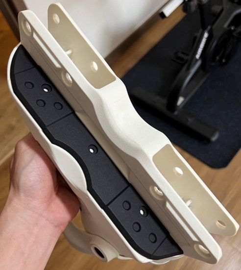
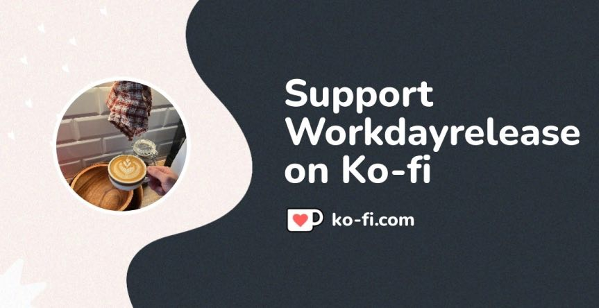

# Custom Aeon slider by Asher
**STL file of CAD model for USD AEON size 41-42 for 3D printing.** 

## Commercial alternative
A commercial solution is available. However, for some regions custom 3DP may be a cheaper alternative. One may also wish to print a single side only. The contact area for a soul based grind is about 56.7% lesser when compared to a commercial solution, which in theory means less friction and a faster grind. However, this is in theory and the project makes no guarentee of being better than any commercial solutions out there. The mounting points (counter-bore hole) are also slightly different to make it easier as some may experience difficulty mounting the back tee nut. 

For me, this is a passion project. I decided to challenge myself by learning a whole new skillset and a few softwares. 

## Material Recommendation
It is recommended that this model be printed in **Nylon (MJF/SLS PA-12)** for optimal performance and durability. If you have access to UHMW plastic, that would be even better. 

## No Liability Statement
The creator of this 3D model makes no warranties or representations about the accuracy, completeness, or suitability of this model for any purpose. The use of this model is entirely at the user's own risk. The creator shall not be held liable for any damages, breakages, injuries, or any other incidents that occur from the use, misuse, or modification of this model. 

By downloading or using this model, you agree to these terms and assume full responsibility for any consequences that may arise.

## License: Creative Commons Attribution-NonCommercial-ShareAlike 4.0 International
[Custom-aeon-slider-CAD © 2024 by Asher Chew is licensed under CC BY-NC-SA 4.0](https://creativecommons.org/licenses/by-nc-sa/4.0/)

This license requires that reusers give credit to the creator. It allows reusers to distribute, remix, adapt, and build upon the material in any medium or format, for noncommercial purposes only. If others modify or adapt the material, they must license the modified material under identical terms.
- BY: Credit must be given to you, the creator.
- NC: Only noncommercial use of your work is permitted.
Noncommercial means not primarily intended for or directed towards commercial advantage or monetary compensation.
- SA: Adaptations must be shared under the same terms.

### Credit:
**IG:** findingmybearingsss

## Message from the Creator
While you are **free to use the model for your own skates**, if you do appreciate this work, please consider buying me a coffee on my [Ko-fi](https://ko-fi.com/workdayrelease). Your support is greatly appreciated!

**https://ko-fi.com/workdayrelease**

