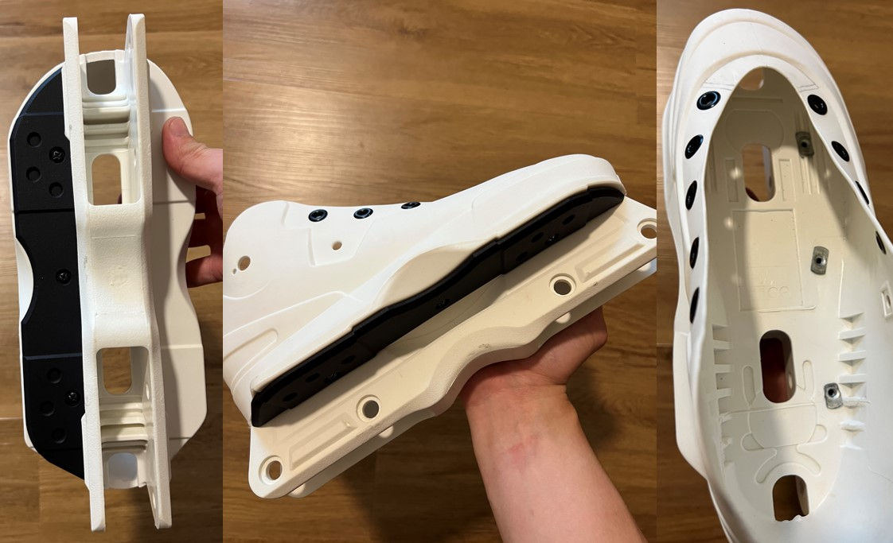

# Custom Aeon slider by Asher
**STL file of CAD model for USD AEON size 41-42 for 3D printing.** 

## Message from the Creator
You can choose to print one side in a cheaper material to test it's fit, if you please. I have printed earlier prototypes and made improvements on the fit as well as surface area of contact to improve speed of grinds.

A commercial solution is available. However, for some regions custom 3DP may be a cheaper alternative. One may also wish to print a single side only. The contact area for a soul based grind is about 56.7% lesser when compared to a commercial solution, which means less friction and a faster grind. For me, this is a passion project. I decided to challenge myself by learning a whole new skillset and a few softwares. 

While you are **free to use the model for your own skates**, if you do appreciate this work, please consider buying me a coffee on my [Ko-fi](https://ko-fi.com/workdayrelease). Your support is greatly appreciated!

### Earlier prototype:

The model in this repository is an improvement of an earlier prototype that is shown in this image. The roughness of the material is due to printing in polycarbonate which the creator do not recommend unless for the purpose of testing the fit of the model. 

Improvements from this prototype included: fit, reduction in taper, change of placement of rear counter-bore hole to make installation easier, re-placement of dimple to suit new rear counter-bore hole, extending groove to improve accuracy of fit. Despite my best efforts, **I cannot guarentee a perfect fit.** Users may print in cheaper material for a test prior to printing in more expensive materials like nylon. 

**Photo of earlier polycarbonate prototype**

## Material Recommendation
It is recommended that this model be printed in UHMW plastic or **Nylon (SLS/MJF PA-12)** for optimal performance and durability.

## Contributing
If you require the model in a different size, you may need to scale it accordingly. Users who wish to print the model in a different size or material can contact the creator to request a STEP file. The STEP file can be provided to those who wish to contribute improvements, with the understanding that any enhancements made will be allowed to be committed back to this repository.

## No Liability Statement
The creator of this 3D model makes no warranties or representations about the accuracy, completeness, or suitability of this model for any purpose. The use of this model is entirely at the user's own risk. The creator shall not be held liable for any damages, breakages, injuries, or any other incidents that occur from the use, misuse, or modification of this model. 

By downloading or using this model, you agree to these terms and assume full responsibility for any consequences that may arise.

## License: Creative Commons Attribution-NonCommercial-ShareAlike 4.0 International
[Custom-aeon-slider-CAD © 2024 by Asher Chew is licensed under CC BY-NC-SA 4.0](https://creativecommons.org/licenses/by-nc-sa/4.0/)

This license requires that reusers give credit to the creator. It allows reusers to distribute, remix, adapt, and build upon the material in any medium or format, for noncommercial purposes only. If others modify or adapt the material, they must license the modified material under identical terms.
- BY: Credit must be given to you, the creator.
- NC: Only noncommercial use of your work is permitted.
Noncommercial means not primarily intended for or directed towards commercial advantage or monetary compensation.
- SA: Adaptations must be shared under the same terms.

### Credit:
Creator: asherchew.zy@gmail.com

Special thanks for 3D printing prototype: auggie.teo@gmail.com
